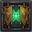

# GreenWall GuildRoster

A companion addon for [GreenWall](https://github.com/AIE-Guild/GreenWall) that shows a combined roster window for all co-guilds in a GreenWall confederation — like the native guild roster, but with everyone's alt guilds mixed into one list.

## What it does

GreenWall bridges guild chat between co-guilds, but each guild's roster is still only visible to its own members. This addon rides GreenWall's own confederation channel (via its public `GreenWallAPI`) plus a background whisper transport for roster data: every member with the addon periodically shares their own guild's roster (name, level, class, zone, online status, rank), and everyone else's addon merges that into one combined window.

- Native-style roster window: Level, Class icon, Name, Zone, Guild, Status, Alt
- All co-guilds mixed together, sortable by any column (click the header, click again to reverse)
- Guild column color-codes your own guild vs. the other co-guild(s)
- Guild Master / Officer crowns next to names, same as the native frame
- "Show offline" toggle
- Right-click a name to whisper, invite, or copy their name
- Minimap button (drag to reposition, left-click toggles the window, right-click broadcasts) - can be hidden via Options > AddOns > GreenWall GuildRoster or `/gwgr minimap`
- Tracks and displays how long ago you last broadcast your own roster
- Self-declared cross-guild alt links (`/gwgr setmain <name>`) show under Alt for a twink in another co-guild
- Automatic background sync once you've made first contact (see How it works)
- A departed co-guild member (kicked, left, character deleted) gets explicitly cleared out instead of lingering as a stale entry forever
- English/German UI, auto-detected from your client language - see [TRANSLATING.md](TRANSLATING.md) to help add another

## Requirements

- [GreenWall](https://www.curseforge.com/wow/addons/greenwall) (v1.12+) already set up and working between your co-guilds. It's a hard dependency, not optional - this addon uses GreenWall's own `GreenWallAPI` to ride its already-established confederation channel, so there's no extra channel/password to configure. The "GreenWall - Revived" fork's changes were merged back into the official GreenWall as of v1.12.0, so there's no longer a reason to use the fork specifically.

## Installation

1. Copy the `GreenWallGuildRoster` folder into your `Interface/AddOns/` directory.
2. `/reload`. No guild-info configuration needed beyond GreenWall's own setup.

## Usage

- `/gwgr` — open/close the roster window
- `/gwgr broadcast` — send your guild's current roster to the other co-guilds (via GreenWall's confederation channel, manual)
- `/gwgr status` — show GreenWallAPI availability and your own tag
- `/gwgr setmain <name>` — mark the character you're on as an alt of `<name>` (run this on the twink); leave the name off to clear it

## How it works

There are two transports, because Classic's client restricts what's available for each:

1. **Manual channel broadcast** (`Broadcast`): each client reads its own guild's full roster (including offline members, normally only visible within your own guild) and sends it, chunked to fit message limits, via `GreenWallAPI.SendMessage` - GreenWall's own third-party API, which rides its already-joined confederation channel framed distinctly from GreenWall's own chat/notice/bridge traffic. This only ever runs from a direct click (button, minimap right-click, or `/gwgr broadcast`) — under the hood it still ends up at `SendChatMessage`, a protected function in this client build that gets silently blocked if called from a timer or event handler. This is how you make first contact with the other co-guild(s).
2. **Automatic background sync**: once a client has learned at least one online member's name from a peer co-guild (via #1), it whispers its own roster data to a rotating handful of them every few minutes and on roster changes, using `SendAddonMessage` — silent, invisible addon-to-addon data, not chat. This normally isn't gated behind a user action... except Classic disables `SendAddonMessage`'s `CHANNEL` target specifically ("to prevent players communicating over custom chat channels" per Blizzard's own docs), so it targets `WHISPER` at known-online peers instead. No handshake or reachability check first: if a target has logged off or doesn't have the addon, the whisper just goes nowhere, harmlessly. Both sides doing this every cycle gives enough redundancy without needing to verify anyone can "answer" first.

So: click Broadcast once to introduce your guild to the other co-guild(s), and it should stay in sync automatically after that. The window shows how long ago your last manual broadcast was, as a reminder in case the automatic sync ever needs a nudge (e.g. after a long period with nobody from a co-guild online).

**Relationship to GreenWall's code:** the broadcast/receive logic here is a from-scratch implementation on top of GreenWall's public `GreenWallAPI`, not code reused from GreenWall's internals. This addon also reads the `GWp:guildname:tag` lines already present in your Guild Information page, purely to map a tag back to a guild name for display — that's read-only and doesn't touch any of GreenWall's own Lua state.

## Known limitations

- Roster data for the other co-guild(s) is only as fresh as the last time someone there broadcasted.
- Very large guilds mean a lot of chunked messages per broadcast; there's no batching/throttling beyond keeping each message under the chat length limit.
- Built and tested against Classic Era (Interface 11509).

## License

MIT, see [LICENSE](LICENSE). The icon is AI-generated artwork made for this project.

## Contributing a translation

Play on a non-English/German client and want zone names translated correctly for your language? See [TRANSLATING.md](TRANSLATING.md) - a two-minute in-game export for outdoor zones/cities/battlegrounds, plus automatic background collection of dungeon/instance names as you play. No research needed either way.
